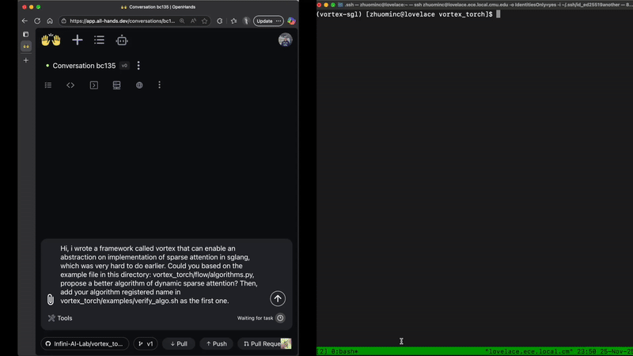

<p align="center">
  
</p>

<h3 align="center">
Vortex: A Flexible and Efficient Sparse Attention Framework
</h3>

<p align="center">
  <a href="https://infini-ai-lab.github.io/vortex_torch/docs/"><b>Documentation</b></a>
</p>


Vortex is a lightweight, modular framework for building **custom sparse attention algorithms** for LLM inference.  
It exists to make it easy for researchers and engineers to **prototype**, **extend**, and **deploy** advanced sparsity patterns on modern inference backends such as SGLang—without modifying core model code.

Vortex allows you to express novel sparse attention concisely while relying on an optimized execution engine.

<figure>
  
  <figcaption align="center"><em>OpenHands generate a sparse attention algorithm (up to 2.7X speedup in this example).</em></figcaption>
</figure>


---

## ✨ Key Features

- **Easy Programming**  
  Program sparse attention with a PyTorch-like frontend. No worrying about batching, caching & paged attention.

- **High Performance**  
  Built to work with FlashInfer & CUDA Graph & Radix Attention for efficient LLM inference.

---

## 🚀 Installation

```bash
git clone --recursive https://github.com/Infini-AI-Lab/vortex_torch.git

# Install SGLang dependency
cd third_party/sglang/v0.5.9/sglang
pip install -e "python"
cd ../../../../

# Install Vortex
cd vortex_torch
pip install -e .
```

---

## 🤖 AI-Generated Sparse Attention

Vortex is designed not only for hand-crafted sparsity patterns but also for AI-generated sparse attention.

Our demo shows how to use SOTA agents OpenHands (https://openhands.dev/) to generate sparse attention algorithms.

```bash
export LLM_API_KEY=YOUR_API_KEY
python AI/openhands_gen.py

```

The usage and installation guide of OpenHands can be found in https://docs.openhands.dev/sdk. 

Note: Some operators are not yet fused or fully optimized, which may lead to increased memory usage. Tune down the `mem_fraction_static` if CUDA OOM. This can also impact generation speed during inference. 

---

## 🧠 Iterate & Innovate with Claude Code

Vortex ships a [Claude Code](https://claude.com/claude-code) workspace
(`.claude/`) that turns the framework into an autonomous *algorithm
scientist*: Claude writes sparse-attention submissions, compiles them,
benchmarks them on AIME24, and pushes the accuracy/throughput Pareto
frontier outward — one batch at a time. Start a session from the repo
root and drive it with slash commands:

| Command | What it does |
| --- | --- |
| `/new-submission <name>` | Scaffold a new submission pair (`.py` + `.json`). |
| `/preflight <name>` | Cheap CPU-only config check before spending GPU time. |
| `/innovate <N> [theme]` | **Innovate** — draft `N` *genuinely novel* algorithms in one shot. All must compile; no benchmark loop. Great for brainstorming ideas the literature doesn't cover. |
| `/iterate [--max-iterations <N>]` | **Iterate** — the long-horizon loop: design 4 orthogonal variants → pre-flight → RULER quality gate → benchmark on AIME24 → analyse → repeat. Autonomously maps the Pareto frontier. |
| `/batch-benchmark <n1> <n2> <n3> <n4>` | Launch a 4-variant batch on the currently-free GPUs. |
| `/review <name>` | Audit a submission against the contract without editing it. |

**Innovate** (explore) and **iterate** (exploit) are complementary:
`/innovate` generates fresh, compile-checked ideas with no GPU cost,
while `/iterate` benchmarks four variants per batch and folds the
results back into `algorithm_scientist/memory.md` so later sessions
resume from the running best. The full contract, knobs, and benchmark
protocol live under [`AI/`](AI/) (start with
[`AI/AGENTS.md`](AI/AGENTS.md)) and
[`papers/guide.md`](papers/guide.md).

```bash
# from a Claude Code session opened at the repo root
/innovate 4 channel-sparsity      # draft 4 novel ideas to explore
/iterate --max-iterations 3       # run 3 autonomous benchmark batches
```

---

## 🧩 Quick Example: Custom Sparse Attention

A working setup is **two files**:

1. **The flow module** (this section) — a `.py` file that *defines* your
   sparse-attention algorithm as a `vFlow` subclass and `@register`s it
   under a name. It contains only vortex ops; it never imports sglang.
2. **The launch script** ([next section](#-launch-it-with-sglang)) —
   imports `sglang` + `vortex_torch` and starts the engine pointing at
   the flow by its registered name.

### 1. Define the flow — `custom_sparse_attention.py`

A `vFlow` declares its cache layout in `create_cache`, refreshes
per-page state in `forward_cache`, and scores/selects pages every decode
step in `forward_indexer`. Save the snippet below anywhere on disk (e.g.
`custom_sparse_attention.py`) — you'll point the engine at it by path +
registered name.

```python
from typing import Dict
import torch

from vortex_torch.flow import vFlow, register
from vortex_torch.indexer import GeMM, Mean, topK
from vortex_torch.cache import Mean as CMean
from vortex_torch.abs import ContextBase


@register("custom_sparse_attention")
class CustomSparseAttention(vFlow):

    def __init__(self):
        super().__init__()
        # Indexer-side ops (run every decode step)
        self.mean = Mean(dim=1)        # average over the query heads
        self.gemm = GeMM()             # GeMM(x, y) = y @ xᵀ
        self.output_func = topK()      # must end in topK / approxTopK

        # Cache-side ops (run once per finished page)
        self.reduction = CMean(dim=1)  # one centroid (mean key) per page

    def forward_indexer(
        self,
        q: torch.Tensor,                 # viewed as [B, H_q, D]
        o: torch.Tensor,
        cache: Dict[str, torch.Tensor],  # viewed as [S, r, c] per create_cache()
        ctx: ContextBase,
    ):
        # No native torch ops here — every tensor flows through vortex ops.
        q_mean = self.mean(q, ctx=ctx)                          # [B, 1, D]
        score = self.gemm(q_mean, cache["centroids"], ctx=ctx)  # [S, 1, 1]
        self.output_func(score, o, ctx=ctx)                     # selected pages -> o

    def forward_cache(
        self,
        cache: Dict[str, torch.Tensor],  # viewed as [B, r, c] per create_cache()
        loc: torch.Tensor,
        ctx: ContextBase,
    ):
        # triggered only when a page is finished
        self.reduction(cache["k"], cache["centroids"], loc=loc, ctx=ctx)

    def create_cache(self, block_size: int, head_dim: int):
        # "k" and "v" are provided automatically — do not declare them
        return {
            "centroids": (1, head_dim),
        }
```

---

## 🏃 Launch it with SGLang

The launch script is a **separate file** from the flow. It imports
sglang and vortex_torch, then starts the engine. Importing `vortex_torch`
is what wires vortex into sglang's decode loop (it installs the
`ServerArgs` ↔ `VortexConfig` adapter), so the import is required even
though you don't call it directly.

```python
import sglang as sgl
import vortex_torch  # noqa: F401 — import for side effect: installs the VortexConfig adapter
from vortex_torch.engine.sgl.config import VortexConfig

llm = sgl.Engine(
    # --- standard sglang engine args ---
    model_path="Qwen/Qwen3-0.6B",
    page_size=16,                     # KV page size (pages are vortex's unit of sparsity)
    attention_backend="flashinfer",   # Mandatory
    disable_overlap_schedule=True,    # Mandatory
    disable_cuda_graph=False,
    mem_fraction_static=0.85,         # turn down if you hit CUDA OOM

    # --- all vortex knobs live in one object ---
    # Passing `vortex=` turns sparsity ON (no separate enable flag needed);
    # omit it and you get plain dense attention.
    vortex=VortexConfig(
        module_path="path/to/custom_sparse_attention.py",
        module_name="custom_sparse_attention",  # the @register name of your vFlow
        topk_val=30,                  # keep the 30 highest-scoring pages per query
        layers_skip=[0],              # layer 0 runs full/dense attention
        block_reserved_bos=1,         # always keep the first page (attention sink)
        block_reserved_eos=1,         # always keep the last (most recent) page
        max_seq_lens=8192,
    ),
)
```

### What is `VortexConfig`?

`VortexConfig` is a single dataclass
([`vortex_torch/engine/sgl/config.py`](vortex_torch/engine/sgl/config.py))
that holds **every** vortex sparse-attention hyper-parameter in one place,
instead of ~18 loose `vortex_*` arguments scattered across sglang's
`ServerArgs`. Its presence on the engine is also the on/off switch: pass a
`VortexConfig` and sparsity is enabled; leave it out and the model runs
ordinary dense attention. The most useful fields:

| Field | Meaning |
| --- | --- |
| `module_path` | Path to your flow's `.py` file. If omitted, vortex searches `vortex_torch.flow.algorithms`. |
| `module_name` | The `@register` name of the `vFlow` to load. |
| `topk_val` | Page budget — how many pages each query keeps. The core accuracy↔throughput knob. |
| `topk_ratio` | Budget as a fraction of context instead of a fixed count (`0.0` = use `topk_val`). |
| `layers_skip` | List of layer indices that stay **full/dense** (e.g. early layers that need global context). |
| `block_reserved_bos` / `block_reserved_eos` | Pages always kept at the start / end (attention sinks + most-recent tokens). |
| `max_seq_lens` | Maximum sequence length to plan for (`-1` = model default). |
| `block_size` | Vortex page size (defaults to sglang's `page_size`). |
| `dtype` | Compute/KV dtype for the indexer (`"bfloat16"` default; `"float8_*"` for cheaper KV). |
| `attention_backend` / `impl_backend` | `flashinfer` (default) vs `trtllm`; kernel impl backend (`triton`). |

Prefer the explicit `VortexConfig(...)` object above. The legacy flat form
— `sgl.Engine(enable_vortex_sparsity=True, vortex_topk_val=30, vortex_module_name=..., ...)`
— still works (the adapter folds those `vortex_*` kwargs into a
`VortexConfig` for you), but the object is clearer and self-documenting.

---


## 📘 API Reference

👉 https://infini-ai-lab.github.io/vortex_torch/


